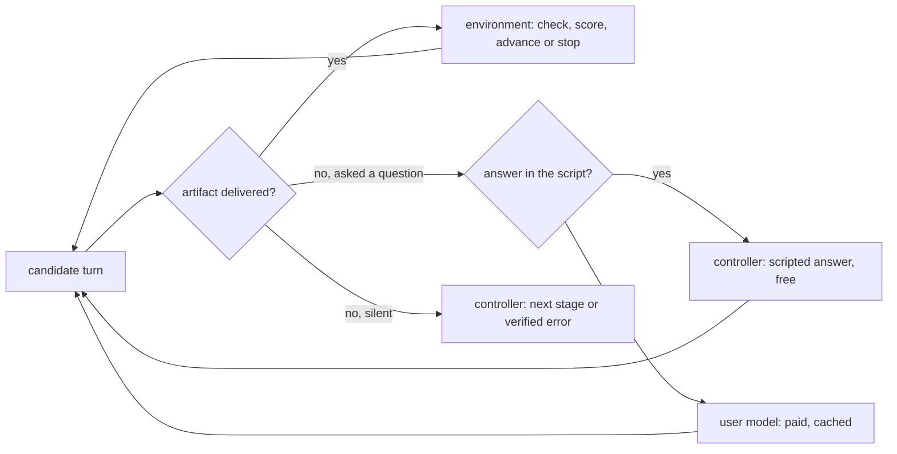

# Simulated author and the multi-turn loop

Proposed design, 2026-09-21. Supplies the author's turns when no human is present, so
multi-turn sessions can be generated and used as RL rollouts. Extends the composed-session
sketch in [multi-turn RL](multi-turn-rl.md), which already names the controller, the
simulated author, and the frozen-simulator constraint. The underspecification case it
serves is defined in the [training-distribution axes](training-distribution-axes.md).

## The loop

The **environment** terminates and scores. The **controller** scripts the common turns.
The **user model** speaks only when a turn cannot be scripted.

## Two completion questions

Do not merge them.

| Question | Owner | Nature |
|---|---|---|
| Is the task complete? | environment | deterministic: artifact delivered, checks pass |
| Does the author have more to say? | user model | soft judgment |

The user model never ends an episode; it only emits a turn. If its "done" were the gate,
episodes would truncate the moment *something* appeared, and the policy could learn to
manipulate the partner into declaring completion. This restates an existing rule: the
author's approval is not the reward and not proof of correctness.

## Two hidden things

The private package holds both, and they are revealed differently.

| Hidden content | Reveal? |
|---|---|
| The author's **decisions** (the answers to "which direction?") | yes, on request — this is what clarification is for |
| The **rubric** and reward labels | never |

A user model that conflates them leaks the scoring criteria and teaches the policy to fish
for the rubric instead of the author's intent.

## Three layers

1. **Environment.** Workspace tools, artifact checks, termination, reward. All of it is
   deterministic and independent of the partner's opinion.
2. **Controller.** Decides, per turn, whether the candidate asked a question or delivered
   an artifact; routes to a scripted answer, a lookup in the hidden spec, the next
   scripted stage, a verified error, or termination. No model call.
3. **User model.** A paid call that receives the hidden decisions, the task goal, and the
   transcript, and returns one author turn. It is grounded in the decisions, never states
   the rubric, and never solves the task.

The detection signal already exists: [`agent.py`](../../src/writing_agent/agent.py)
distinguishes a final response from follow-up continuation, and the workspace shows
whether the required artifact was produced.

## Cost, cache, and parallelism

- **Script first.** For the primary case the withheld decisions are enumerated in the
  private spec, so the answer is a lookup, not a generation. Most clarify turns should hit
  the controller, not the model.
- **Cache the paid turns** by `(task, question, turn)`, reusing the identity and ledger
  pattern in [`paid.py`](../../src/writing_agent/paid.py). Parallel rollouts that ask the
  same question share one paid answer.
- **Transcript growth.** A naive user-model call per turn grows input tokens every turn,
  so cost is near-quadratic in turns. The script and cache path keeps it near-linear.
- **Parallelism is not free.** The runner is serial today and assumes one writer per run
  directory ([`suite.py`](../../src/writing_agent/suite.py)). Parallel rollouts need one
  run directory per worker, a shared budget ledger under the existing lock, and a shared
  cache. This is throughput work, not research, and can follow a working serial loop.
- **Concurrency is not determinism.** If the partner samples, members of a group are not
  comparable. Use temperature 0, seed the partner, and cache per group.

## Frozen partner, and the confound

Training against one partner overfits to that partner's phrasing and expectations: the
policy learns what this author wants, not what writers want. Guard rails:

- Freeze the partner version per experiment for reproducibility.
- Treat partner identity as axis G in the [training-distribution axes](training-distribution-axes.md):
  a nuisance axis to vary once the loop works.
- For **evaluation**, do not reuse the cheap training partner. Use a held-out strong model
  or human judgment, or the measurement grades the policy on pleasing a weak interlocutor.

## Constraints

These are easy to violate and are already stated in [multi-turn RL](multi-turn-rl.md):

- Ground the partner in the hidden decisions; reveal only what the author would know.
- Never expose private rubrics or reward labels in a turn.
- The partner's approval is not the reward and not evidence of success.
- Do not invent an error to force a correction turn; a semantic error needs source
  evidence.
- **Loss-mask the partner's turns.** Simulator messages and tool observations are context,
  never learning targets.

## Leash

The partner will keep talking. Bound it with a stage plan, a maximum turn count, and the
environment's acceptance check, and record session ID, stage IDs, turn index, the
partner's decision, feedback provenance, and simulator identity.

## Next work

Build the controller and scripted-answer path first, validate a short mixed-family session
with no user model, then add the paid user-model fallback with caching. Defer the parallel
runner until the serial loop is reliable. See [multi-turn RL](multi-turn-rl.md) for the
reward-and-credit and compaction work this loop feeds.
