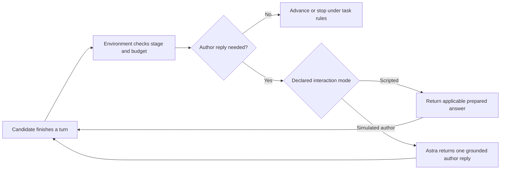

# Simulated author and the multi-turn loop

Proposed design, 2026-09-21. Supplies the author's turns when no human is present, so
multi-turn sessions can be generated and used as RL rollouts. Extends the composed-session
sketch in [multi-turn RL](multi-turn-rl.md), which already names the controller, the
simulated author, and the frozen-simulator constraint. The underspecification case it
serves is defined in the [training-distribution axes](training-distribution-axes.md).

## Declare which tasks need a simulated author

Mark the interaction mode when authoring a task rather than running a classifier on
every turn. Proposed modes are `none`, `scripted`, and `simulated_author`; these are
not yet implemented schema fields. A task that requires adaptive answers to questions
or reactions to revisions should explicitly request `simulated_author`. Astra is the
proposed initial model for that role; pin its model and runner configuration per run.

The candidate is the writing assistant being trained. The simulated author plays the
human collaborator. Both may use language models, but their roles and access differ.

## The loop

The environment controls completion and scoring. A delivered artifact may still need
feedback or revision; its existence alone does not end the session. In scripted mode,
a question outside the script must be recorded as unsupported, not answered with an
unrelated canned reply. Allow an Astra fallback only when the task explicitly permits
it; otherwise stop with an environment-coverage error rather than blaming the candidate.
Jev-based routing remains an optional idea, not a required layer.

## Two completion questions

Do not merge them.

| Question | Owner | Nature |
|---|---|---|
| Is the task complete? | environment | deterministic: artifact delivered, checks pass |
| Does the author have more to say? | user model | soft judgment |

The user model never ends an episode; it only emits a turn. If its "done" were the gate,
episodes would truncate the moment *something* appeared, and the policy could learn to
manipulate the partner into declaring completion. This restates an existing rule: the
author's approval is not the reward and not proof of correctness.

## Two hidden things

The private package holds both, and they are revealed differently.

| Hidden content | Reveal? |
|---|---|
| The author's **decisions** (the answers to "which direction?") | yes, on request — this is what clarification is for |
| The **rubric** and reward labels | never |

A user model that conflates them leaks the scoring criteria and teaches the policy to fish
for the rubric instead of the author's intent.

## Three layers

1. **Environment.** Owns workspace tools, stage boundaries, budgets, termination, and
   reward calculation. Semantic grading is separate from the partner's opinion; author
   approval is never sufficient evidence of success.
2. **Controller.** Follows the declared interaction mode and stage plan. It supplies
   applicable scripted answers or invokes the simulated author when a reply is needed.
   Natural-language question matching is not assumed to be perfectly deterministic.
3. **Simulated author.** Receives the author's decisions, task goal, relevant project
   evidence, and transcript, and returns one author turn. It never receives private
   grading criteria, solves the assignment, or edits the candidate's workspace.

The current [`agent.py`](../../src/writing_agent/agent.py) records assistant replies,
tool observations, and workspace snapshots, then consumes fixed follow-ups. It does
not yet implement adaptive author replies or reliable question-to-script matching.
Artifact presence is useful evidence, not proof that the requested work is complete.

## Cost, cache, and parallelism

- **Avoid unnecessary calls.** Single-turn tasks need no simulated author. Scripted
  tasks use prepared answers where applicable; adaptive tasks explicitly budget Astra
  calls. Do not call the author after each workspace tool observation.
- **Keep a stable prompt prefix.** Put role instructions, fixed author preferences, and
  immutable starting context first; append conversation turns and changing project
  evidence afterward. Keep serialization stable and avoid timestamps or run identifiers
  in that prefix. An isolated author session may preserve the append-only history, but
  never share evolving conversation state across different candidate attempts.
- **Distinguish two caches.** Provider prompt caching may reuse a common token prefix;
  it does not reuse the final answer and is not guaranteed by the pi/Codex runner. Measure
  reported cached input tokens where available; [OpenAI's caching guide](https://developers.openai.com/api/docs/guides/prompt-caching)
  describes prefix matching but does not verify our runner's behavior. A local response cache reuses an exact
  answer only when the entire author-visible input, relevant state, model/configuration,
  and prompt version match. `(task, question, turn)` alone is unsafe: the same question
  can refer to different drafts or previously selected alternatives.
- **Transcript growth.** Appending a growing history can incur near-quadratic input-token
  volume over many turns. Prefix caching can reduce cost or latency, not the logical
  context length. Record cache usage rather than claiming a fixed saving.
- **Parallelism is not free.** The runner is serial today and assumes one writer per run
  directory ([`suite.py`](../../src/writing_agent/suite.py)). Parallel rollouts need one
  run directory per worker, a shared budget ledger under the existing lock, and a shared
  cache. This is throughput work, not research, and can follow a working serial loop.
- **Control partner variability.** Freeze the author model, preferences, and instructions
  across a GRPO group. Responses may legitimately differ with candidate actions. Use
  deterministic generation settings where supported and exact-input response caching;
  temperature zero or a seed does not guarantee service-level reproducibility.

## Frozen partner, and the confound

Training against one partner overfits to that partner's phrasing and expectations: the
policy learns what this author wants, not what writers want. Guard rails:

- Freeze the partner version per experiment for reproducibility.
- Treat partner identity as axis G in the [training-distribution axes](training-distribution-axes.md):
  a nuisance axis to vary once the loop works.
- For **evaluation**, do not reuse the cheap training partner. Use a held-out strong model
  or human judgment, or the measurement grades the policy on pleasing a weak interlocutor.

## Constraints

These are easy to violate and are already stated in [multi-turn RL](multi-turn-rl.md):

- Ground the partner in the hidden decisions; reveal only what the author would know.
- Never expose private rubrics or reward labels in a turn.
- The partner's approval is not the reward and not evidence of success.
- Do not invent an error to force a correction turn; a semantic error needs source
  evidence.
- **Loss-mask the partner's turns.** Simulator messages and tool observations are context,
  never learning targets.

## Self-play is a separate experiment

An optional alternative is to use a frozen copy of the candidate model as the simulated
author. This saves access to a second model family but does not make generation free or
establish that it can simulate the author faithfully. Keep its session and private author
preferences separate from the candidate's context, and validate its behavior against the
Astra partner before relying on it.

Training both roles together is a further, unapproved experiment. It needs a separate
author objective for faithful, consistent feedback. Rewarding both sides only for candidate
success invites an author that relaxes the task or gives away the answer. A changing author
also changes the training environment. Freeze a partner snapshot during each experiment;
author turns remain excluded from candidate loss. If author-role training is added later,
train those actions in separately identified trajectories with their own evaluation.

## Bounded sessions

Declare a maximum turn/tool/token budget and record the termination reason. If required
work is unfinished when the interaction limit is reached, label it incomplete and apply
the predeclared completion penalty or cap. Do not invent its numeric value here. Preserve
stage scores for diagnosis. If the work is complete on the final allowed turn, reaching
the limit alone is not failure. Provider outages or unsupported simulator behavior are
environment errors, not evidence that the candidate deserves a low score.

Record session ID, stage IDs, turn index, partner decision, feedback provenance, and
simulator identity. An iteration limit prevents endless self-dialogue but does not prevent
self-approval or reward gaming; independent checks remain necessary.

## Next work

Add declared interaction modes, validate a short scripted session, then a bounded
Astra-author session with stable-prefix prompts and exact-input response caching. Verify
the pi/Codex adapter's text-only operation and usage reporting rather than assuming
OpenAI chat-completions transport. Keep author calls isolated from repository instructions,
private rubrics, and candidate workspace tools. Defer routing classifiers, jointly trained
self-play, and parallel execution until the serial loop is reliable. See
[multi-turn RL](multi-turn-rl.md) for reward, credit, and compaction.
