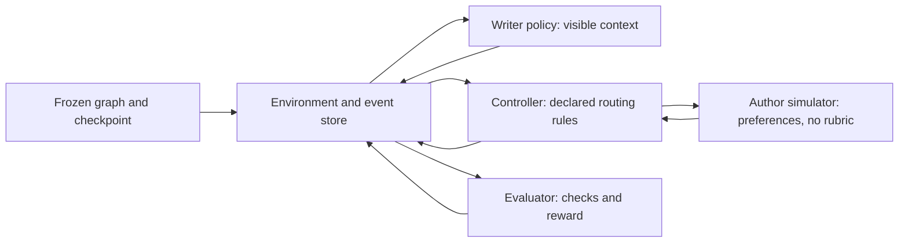
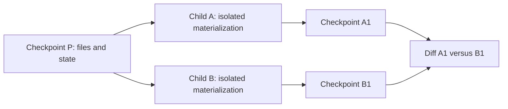
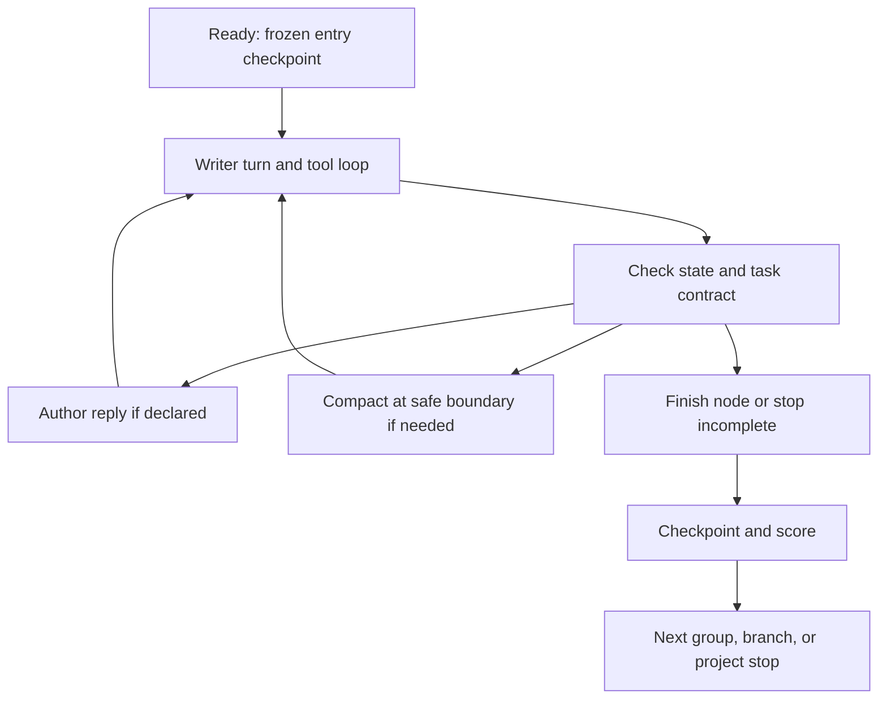

# Checkpointed task-graph environment

**Proposed architecture, 2026-09-24; not an implemented runner.** The environment
instantiates a versioned task graph and samples **bounded trajectories, each one
walk through that graph**. Immutable checkpoints preserve files *and* execution
state. A simulated author supplies user utterances, never transitions, completion,
or rewards. GRPO compares isolated writer rollouts from one frozen starting state.

This is the authoritative runtime design. [Simulated author](simulated-author.md)
defines collaborator behavior; [multi-turn RL](multi-turn-rl.md) supplies research
rationale; [task generation and rewards](rl-task-generation.md) supplies admission
and reward proposals. Where those sketches differ, this contract governs. All
schemas/APIs below are proposed. Current implementation is distinguished explicitly.

**Reading map:** [boundaries](#1-boundaries-the-environment-executes-the-author-does-not-judge)
· [current behavior](#2-what-exists-today-and-what-must-change)
· [state](#3-state-checkpoint-everything-that-can-change-the-next-step)
· [events/context](#4-events-are-canonical-messages-are-one-projection)
· [checkpoints](#5-immutable-checkpoints-full-envelopes-first-no-git)
· [lifecycle](#6-lifecycle-finite-walks-persistent-project-state)
· [GRPO](#7-grpo-group-identity-is-stricter-than-file-equality)
· [failures](#8-failure-is-not-one-boolean)
· [runtime](#9-runtime-and-security-boundary)
· [API](#10-persistence-and-minimal-api)
· [migration](#11-migration-and-verification-gates)
· [stream](#12-open-ended-stream-bounded-compute)
· [alternatives](#13-alternatives-and-unresolved-experiment-choices).

## 1. Boundaries: the environment executes; the author does not judge



The environment is the trusted state-machine executor, not a language model or
just a directory. It owns the workspace, budgets, event commit, access projections,
checkpoint store, and enforcement of the frozen task contract. The controller
selects a *proposed* permitted next step; the environment validates and commits it.
The evaluator reports evidence/results; it cannot write project state. Dependencies
point to versioned record contracts, not to another role's prompts or mutable internals.
These are module/API boundaries initially; private-data separation is a trust boundary
whether or not components share a process.

### Canonical vocabulary

| Term | One meaning |
|---|---|
| Task/template graph | Reusable versioned program: node specifications, legal edges, bounded loops, entry rules and exit conditions; not a transcript or trajectory |
| Instantiated graph | Immutable template plus concrete source packet, requests, author preferences, requirements, checks, budgets, seeds and resolved node/edge IDs |
| Node | Bounded unit of writer work (families F1–F5) or an environment operation, with an explicit entry/exit contract |
| Environment | Trusted executor and state/persistence boundary; includes controller orchestration, not the writer model |
| Controller | Versioned routing and interaction policy; asks for author utterances and proposes transitions under the task contract |
| Writer policy | Model being trained; emits assistant text and permitted tool calls |
| Author simulator | Scripted or model-backed collaborator producing a user utterance grounded in authorized author decisions; never a scorer |
| Evaluator / reward | Independent deterministic checks and optional semantic judgments; a versioned reward adapter produces a scalar from declared evidence |
| Event log | Append-only causal history, including private operational events; not directly a model prompt |
| Message | Role-tagged conversational payload inside an event; not all events are messages |
| Active context | Exact bounded writer input derived from authorized messages, files returned by tools, and explicit context transformations |
| Checkpoint | Immutable, restorable environment-state envelope, with parent linkage and referenced immutable artifacts; distinct from model-weight checkpoints |
| Trajectory / rollout | One realized bounded walk with its writer actions, observations, state changes and outcome; aliases here |
| GRPO group | A sealed collection of rollouts sharing a frozen task/start checkpoint and sampling/evaluation contract; never a graph |
| Project lineage | Checkpoint ancestry across walks, branches and policy versions; not one endless rollout |

“Session” is informal conversation/run terminology only; use rollout ID, node visit
ID and lineage ID in records. An author turn is an interaction inside a writer node,
not a second learnable graph actor. `stage_families` and `followups` are legacy fields.

### Ownership and information access

| Concern | Authority | Inputs and forbidden shortcuts |
|---|---|---|
| Graph admission | Task compiler/validator | Freeze satisfiable tasks, declared edge guards and independent source evidence before sampling |
| Next edge, branch, node completion, termination | Environment | Controller proposal + frozen guards + evaluator evidence + budgets; author praise/“done” is never a guard |
| Whether/how to solicit a user reply | Controller | Declared interaction mode and writer output; no author-model transition command |
| Wording of user utterance | Script or author simulator | Approved task goal, disclosed history/project evidence and revealable preferences; cannot edit files |
| Hidden preferences | Immutable author packet | Author knows permitted preferences; writer learns permitted answers via user messages, not packet access |
| Requirement/decision changes | Environment | Only preauthorized graph events or validated choices; version and supersede old entries; writer assertions never become truth automatically |
| Mechanical/semantic checks | Evaluator | Private check specification and independent evidence; failed checks are not rewritten by controller or simulator |
| Reward and training eligibility | Reward adapter / group coordinator | Frozen reward contract; no reward, advantage, rubric or sibling rollout in writer/author inputs |
| Context transformation | Environment context manager | Fixed versioned policy; summary is derived memory, never authoritative requirements |

The simulator API has **no `ACTION`, `TARGET`, `DONE`, reward or pass/fail field**.
It returns one utterance plus grounding metadata (decision IDs and evidence references).
A literal “done” in its text is ordinary user language. Explicit preference choices
may satisfy a declared *interaction* milestone, not establish artifact correctness.
Partial completion is legal only when declared by the node's exit contract before
sampling; label it `accepted_partial`, not full success. Mandatory checks cannot be
waived post hoc. Optional model-based routing is deferred; v1 uses declared rules
and prepared answer matching with an explicit unsupported case, not a hidden
classifier assumed to understand every question. V1 uses the explicit graph-only
`ask_author` control tool defined below; natural-language question matching is not
part of the runtime contract. This protocol is a proposed addition, not current
workspace behavior.

The author receives neither private grading material nor model-private reasoning.
It may receive undisclosed author preferences, but never withheld evaluation passages
or labels. Actor-specific projections enforce this; prompts alone are not the access
control. Model-backed utterances require structural and grounding validation; when
fidelity cannot be established, record a simulator error rather than silently invent
an answer. Script misses are coverage errors unless a frozen fallback was declared.

## 2. What exists today, and what must change

| Implemented evidence | Consequence for this design |
|---|---|
| [`Workspace.snapshot()`](../../src/writing_agent/workspace.py) returns path-to-text; defaults 128,000 bytes/file and 1,000,000 bytes total | Useful file snapshot, not an environment checkpoint; no restore/branch API |
| [`agent.py`](../../src/writing_agent/agent.py) has a bounded message/tool loop, fixed follow-ups, tool observations and per-completed-turn file snapshots | Retain tool semantics; replace fixed follow-up sequencing with a controller |
| [`suite.py`](../../src/writing_agent/suite.py) isolates attempts, saves before/after artifacts, resumes completed identities and retries interruptions from clean state | Evaluation resume is not mid-rollout restore; maintain historical records separately |
| [`data.py`](../../src/writing_agent/data.py) validates reviewed training trajectories; [`training.py`](../../src/writing_agent/training.py) masks non-assistant material in native training exports | Do not treat a flat exported transcript as canonical state or an RL probability trace |
| [`reward.py`](../../src/writing_agent/reward.py) computes training-side scalar/relative advantages separately from benchmark scoring | Reuse scoring semantics through an adapter, but require a stronger group identity and eligibility gate |
| [Source contracts](../../src/.context/CONTEXT.md) define private labels, path tools, bounded inference and serial run directories | Preserve separation; graph, checkpoint, adaptive-author and GRPO execution contracts are new |

Current workspace tools expose text files, not a shell/browser. The old sketch's
250k context window is **not** a runtime guarantee: use the pinned backend's actual
input-plus-output limit (the current local harness declares 65,536). Store context
capacity separately from total trajectory token/time/tool budgets. No probability
or restore capability is inferred from a saved before/after snapshot.

Existing regression evidence is in [core workspace/agent/data tests](../../tests/test_core.py),
[follow-up/resume tests](../../tests/test_research.py), and
[reward/group tests](../../tests/test_reward.py). They exercise current behavior,
not the proposed checkpoint/graph contracts.

## 3. State: checkpoint everything that can change the next step

An environment state is a versioned value. Its immutable references resolve to
hash-verified artifacts. Private references are available only to authorized services;
materializing a writer workspace must never materialize the envelope or author/rubric
packets there.

| Field group | Required content |
|---|---|
| Graph position | Template ID/hash, instantiated graph hash/schema version, node ID, visit ID, loop counters, phase, entry contract hash, originating start checkpoint (null at entry), edge/branch lineage |
| Project files | Canonical relative path → exact UTF-8 text, file hashes, aggregate file-tree hash, file/tool byte limits |
| History | Event head hash and sequence cursor; branch base event head; imported seed/context provenance; committed action and tool-result IDs |
| Active context | Context revision/artifact hash, ordered message/summary references, visibility projection version, prefix ID, render/template/tokenizer/tool-schema hashes, exact rendered input when sampled |
| Requirements and decisions | Immutable versions for binding requirements, accepted decisions, superseded entries, reveal permissions and disclosure history; author-packet hash and independent source evidence |
| Continuation | Ordered pending tool calls and next-call cursor, unanswered author request, outstanding check/request IDs with target hashes, applied-response IDs and mandatory-feedback cursor |
| Execution configuration | Environment, controller, simulator, evaluator, reward, compactor and tool implementation/config hashes; interaction mode and fallback policy |
| Budgets | Limits **and consumed counters** for turns, model calls, tool calls, returned-read tokens, generated/total tokens, context capacity, author calls, graph hops and wall time; remaining allocation and accounting policy |
| Randomness | Root seed, RNG algorithm/version and serialized states/counters per writer/controller/simulator/environment stream; rollout stream derivation and sampling parameters |
| External inputs | Source identity, raw and normalized content hashes, license/attribution metadata, pinned fetch URL/revision and exact response artifact; all model/simulator/checker nondeterministic responses and request hashes |
| Outcome | Running/terminal phase, task status, execution status, explicit stop reason, pending check/judgment references, node check results, completion evidence and reward status |
| Provenance | Parent checkpoint(s), origin rollout/group/lineage, creator environment version; writer policy/weights/adapter/tokenizer identity for actions already taken and current pinned behavior-policy contract |

Do not checkpoint credentials, live clients, Python objects, KV caches, open handles
or absolute worker paths. Reconstruct these from configuration. Paid-call reservations
and global spend limits live in an external durable ledger: restoring a checkpoint
**never refunds spending or releases uncertain charges**. References to reservations
and logical task-budget counters are checkpointed. Operational timestamps/worker IDs
are side metadata, not task identity. Wall-clock checks become recorded observations;
replaying uses them, not the current clock. Resuming a fresh continuation excludes
paused time but consumes a newly reserved operational allowance under the run policy.

The table above has this minimal typed shape; `Ref[T]` means a hash-addressed
immutable record with the contents required by its table row. Values are data, not
executable objects. All counters are nonnegative integers.

```text
EnvironmentStateV1 = {
  schema: 1, instance_ref: Ref[GraphInstance],
  position: {node_id: str, visit_id: str, phase: Phase,
             entry_contract: Hash, start_checkpoint: Hash | null,
             loop_counts: map[str, int], lineage_id: str},
  files: map[SafePath, Utf8Text], tree_hash: Hash,
  history: {head: Hash | null, seq: int, branch_base: Hash | null},
  context_ref: Ref[ContextRevision],
  requirements_ref: Ref[Requirements], decisions_ref: Ref[Decisions],
  disclosures_ref: Ref[DisclosureLedger], author_packet_ref: Hash | null,
  versions_ref: Ref[ExecutionVersions], budgets_ref: Ref[BudgetState],
  rng_ref: Ref[RandomStreams], external_inputs_ref: Ref[ExternalInputs],
  outcome_ref: Ref[OutcomeState], provenance_ref: Ref[PolicyAndOrigin],
  continuation: {tool_queue: list[ToolCall], next_call: int,
                 author_request: Ref[AuthorRequest] | null,
                 check_requests: list[Ref[CheckRequest]],
                 external_requests: list[RequestID], applied_responses: list[RequestID],
                 feedback_cursor: int},
  in_flight_effects: []
}
Phase = ready_writer | checking | awaiting_author | awaiting_checks |
        ready_transition | terminal
```

`history.head` must equal the enclosing checkpoint's `event_head`; the duplication
is validated, not two independent cursors. At a new entry checkpoint,
`start_checkpoint=null`; the subsequent `rollout_started` event binds that checkpoint
as its origin. No checkpoint contains its own ID. `in_flight_effects=[]` is a required
checkpoint invariant: an immutable checkpoint describes a recoverable logical state,
not a live call. Queued tool calls and unanswered requests are allowed and explicitly
checkpointed. External dispatch/receipt lives in recovery journals; restore consults
those journals before any dispatch, never assuming a missing response means no call.

An absent field required by the schema makes a state non-restorable. Legacy imports
must be labeled `seed_only` rather than filling unknown controller/RNG state with
guesses. Mutable author conversation state, if introduced, is explicit state here;
v1 author calls are stateless over exact recorded requests.

### A node contract is executable configuration

```text
NodeSpec:
  id, kind: writer | environment, families: list[F1..F5]
  entry: request_ref, context_policy, requirement_version, tool_allowlist
  interaction: none | scripted | simulated_author
  author_packet_ref?, script_ref?, fallback_policy, interaction_policy_ref
  budgets, mandatory_checks, optional_checks, completion_contract
  exits: list[{edge_id, guard_ref, target_node?, effect, precedence}]
```

`effect` is `advance | branch | terminate`; clarification stays in the same visit.
The `families` list is empty for an environment node. Completion and check
applicability rules are fixed at entry. Guards are versioned trusted
predicates, not arbitrary code supplied by a generated task. If multiple guards are
true, declared precedence resolves them; missing precedence/unknown targets fail
admission. No applicable guard means continue only if the interaction/repair contract
permits it and budget remains; otherwise terminate incomplete. Cycles require visit
and total-hop bounds. Environment fetch nodes execute before a writer group starts.
Graph growth emits a **new immutable graph version/instance** between groups; it
never changes the contract under active rollouts.

### Clarification is a structured request, not a punctuation classifier

The graph adapter adds one **control tool**, separate from file tools. It is enabled
only when the interaction contract permits it and is included in the exact writer
schema/prompt:

```text
ask_author({
  question: nonempty str,
  decision_ids: list[PublicDecisionID],
  proposals: list[{id: str, text: str}],
  option_refs: list[ProposalID]
})
InteractionPolicyV1 = {
  public_decisions: ordered list[{id: str, label: str}],
  decision_bindings_ref: Hash,       # private mapping to author-packet entries
  max_decisions_per_request: int,
  scripts: map[PublicDecisionID, AnswerRule],
  mandatory_feedback: ordered list[FeedbackRule],
  repeat: replay_disclosed_answer, unsupported: coverage_error,
  fallback: none | pinned_author_adapter
}
AnswerRule = fixed_answer | declared_option_id | declared_option_position
FeedbackRule = {id: str, author_request_template_ref: Hash,
                prerequisite_check_ids: list[str], requirement_update_ref: Hash | null}
```

Deliver at most one mandatory feedback item after each completed writer turn, in
list order, after its prerequisite progress checks pass. Feedback applicability is
frozen at entry; each delivered item advances the cursor once and requires a new
writer continuation before the next item. A requirement update is permitted only
if that item already names its authorized immutable update.

The public IDs/labels identify supported topics but contain no hidden values or
rubric. This deliberately constrained v1 interface exposes clarification opportunities;
it is not a claim to simulate arbitrary human question understanding. Natural-language
routing and fully implicit clarification are later experiments, not hidden dependencies.

`ask_author` must be the only call in that assistant message. A mixed control/file-call
batch is a writer protocol error: reject all calls before executing any, return paired
error results, and charge the declared attempted-call budget. Each requested decision
ID must be declared and unique. Resolve IDs in `public_decisions` order, not prose order.
New proposals become immutable unaccepted proposal records keyed by `(action_id, id)`;
`option_refs` must resolve to those or prior declared proposal records in this node.
An unknown topic/option ID, duplicate ID or too many decisions is a recoverable writer
validation error, **not** a script-coverage failure. Referenced prose without a registered
proposal is unsupported input to this tool; the writer must supply its actual options.

A valid request produces a typed `request_author` directive:

```text
AuthorRequest = {
  request_id, call_id: str | null, question: str,
  decision_refs: ordered list[Hash], resolved_proposals: list[Ref[Proposal]],
  authorized_disclosures: list[Hash], author_view_ref: Hash,
  requirement_version: Hash, remaining_budget_ref: Hash,
  source: writer_request | mandatory_feedback
}
```

A script resolves exact IDs and fixed answer/option rules without semantic matching.
Out-of-range scripted selectors or missing answers for declared topics are task coverage
errors. In model-backed mode, the simulator receives this restricted request plus visible
history/project evidence, never checks. It may ground an authorized choice in the actual
proposals; the environment validates referenced choice IDs and permitted decision values.
A semantic-fidelity validator/version is part of that adapter contract; uncertainty is
explicit simulator error, not proof of faithful simulation. All requested decisions must
be covered, including an explicitly authorized “unknown” answer if that is the scenario.

Already-disclosed immutable decisions reuse their recorded answer; a changed preference
requires a preauthorized requirement-version event, not simulator improvisation. For a
successful tool request, one commit delivers a tool acknowledgement
`{"status":"author_reply_follows"}` plus one `user` utterance and its authorized
ledger changes. The writer next sees a complete tool exchange followed by the author
reply. No intermediate acknowledgement can be observed without the reply. Mandatory
feedback uses the same request shape with `call_id=null` and no invented tool result.

| Writer output / state | Deterministic v1 handling |
|---|---|
| Declaration-only final text | Bind check target; completion/mandatory feedback/repair rules decide next step |
| Question-only final text, no `ask_author` | Ordinary assistant text; no automatic disclosure. Check outcome as for any final turn; instructions tell writer to use the control tool |
| “Drafted it; should Mara leave?” plus valid `ask_author` | Process clarification before a final-turn completion check; do not infer completion from the prose |
| The same mixed prose without the tool | Final-turn check path, not implicit author dispatch |
| Multiple topics in one valid tool request | Resolve in declared topic order; one user reply covers the authorized list |
| Reference to a nonexistent alternative | Writer tool error; no author call or requirement change |
| Required feedback remains after otherwise passing checks | Issue its frozen feedback request before permitting node completion |
| Insufficient author/reply budget | No call; terminate incomplete with the specific budget reason |

This makes the same action and frozen state produce the same directive. It also
separates writer misuse of a declared protocol from genuine holes in simulator coverage.

## 4. Events are canonical; messages are one projection

Append one typed event per committed action, observation or control change. A branch
inherits a history prefix by reference and appends its own suffix; later parent events
never appear in the child. Sequence order is local to the resolved causal chain. An empty history has cursor
0; its first event has sequence 1, and every suffix continues at parent cursor + 1.

```text
EventV1 = {
  id: Hash, previous: Hash | null, seq: int,
  lineage_id: str, rollout_id: str | null, node_visit_id: str | null,
  kind: EventKind, actor: writer | author | environment | evaluator,
  audience: set[writer, author, controller, evaluator, trainer],
  payload_ref: Hash, caused_by: list[Hash],
  versions_ref: Hash, provenance_ref: Hash
}
MessageV1 = {
  role: system | user | assistant | tool,
  content: list[TextPart | ToolCallPart | ToolResultPart],
  call_id: str | null, origin: ActionID | AuthorRequestID | SeedArtifactID,
  trust: instructions | untrusted_data, loss_eligible: bool
}
```

`id` hashes the canonical body excluding `id`; hash chaining covers payload and
provenance references. Timestamps belong in unhashed operational side records.
Unknown event kinds/versions fail closed. Audience is an enforced allowlist, not a
hint for a serializer. Serialize sets (including audience) as sorted unique arrays.
`MessageV1.origin` is a stable logical ID; the containing event hash is supplied by
the projection/index, never embedded back into its own payload. The event store is private; there is no unrestricted writer
“read transcript” tool.

| Event kinds | Payload and model-context treatment |
|---|---|
| `rollout_started` | Slot, origin checkpoint and assigned random streams; private, context-only |
| `writer_action` | Assistant text, structured tool calls, raw generated output reference and action trace; writer-visible and potentially loss-bearing |
| `tool_result` | Call ID, ordered result, validation/operation status, visible observation, file delta, read-budget charge; context-only |
| `author_turn` | One user utterance, grounding IDs, simulator request/response provenance; only utterance enters writer context |
| `external_requested` | Request/reservation ID and apply precondition; context-only unless a declared public status exists |
| `request_entered`, `seed_attached` | Visible request or frozen seed references, provenance and context policy; context-only even if a seed contains assistant text |
| `requirements_changed`, `decision_disclosed` | Versioned authoritative ledger change; only authorized disclosures enter conversation |
| `check_recorded`, `transition_committed`, `termination_recorded` | Private operational evidence; no automatic rendering of check details or reward |
| `context_changed` | Old/new context IDs, carry/seed/drop/compact operation and policy/summary provenance; not a fictitious chat utterance |
| `fetch_recorded`, `external_response`, `budget_charged` | Pinned external inputs and operational observations; only declared public payloads project into context |

Action and call IDs are stable `(rollout_id, ordinal)` identifiers, not their enclosing
event hashes. Trace payloads use `action_id`; the event index maps that ID to its event
hash, avoiding a self-referential hash. Payload before/after fingerprints cover an
**execution-value projection**: file bytes, logical position, active message contents,
requirement/decision values, disclosure values, budget counters, RNG, logical call
queue and outcome values. Exclude history heads, checkpoint IDs and **all provenance
references, including transitive ones**. In particular, hash active message contents
and stable logical origin IDs, not a context-revision ID whose provenance references
this new event. Decision values likewise cannot point back to their disclosure event.

Action IDs and tool-result IDs are logical index keys (for example,
`r1:action:0` and `r1:tool_result:0`), never SHA-256 event hashes. The two ID
classes are validated independently in `history.action_ids` and
`history.tool_result_ids`; event hashes remain separate references, while
tool-call IDs remain the logical call IDs bound by the queue.

Context content and context revision are separate identities: content (exact messages,
tools and rendering inputs) can be hashed before its observation event; the revision
adds source-event provenance after that event is hashed. The checkpoint references
the revision. This preserves exact replay evidence without any payload referring to
its own future event/checkpoint hash.

Tool-call IDs are unique within a rollout. Commit the writer action first, then one
result per call in declared order. Serialize calls in v1, including multiple calls
in one assistant message. Each result binds to its call, before/after state hash and
exact returned text. Invalid calls are observable writer mistakes and consume the
predeclared budget; they do not mutate files. Files modified by successful earlier
calls remain if a later call fails. System-generated tool wrappers and observations
are not writer targets. Check feedback is exposed only through a declared sanitized
feedback channel with independent evidence, never by copying a private rubric into
a user reply.

### Derive context explicitly, never by truncating the event log

1. Resolve a context plan: immutable system/tool instructions, the node request,
   selected visible seed/history messages, optional summary, and retained recent turns.
2. Apply the writer allowlist. Hidden preferences not yet disclosed, checks, rewards,
   other rollouts, author-internal grounding metadata and evaluator prompts stay out.
3. Preserve tool-call/result pairing; never retain half a tool exchange. Treat
   source/file contents as untrusted data, not instruction authority.
4. Render with pinned template, tokenizer, tool schema and reasoning policy. Validate
   input tokens plus reserved output capacity against the actual backend limit.
5. Persist the exact model request before sampling, then attach its hash and token
   sequence to the resulting action trace. An adapter that cannot expose exact
   sampling context is usable for evaluation, not eligible for native on-policy RL.

Context operations have different meanings:

- **Carry:** append newly visible events to active context.
- **Seed:** attach a named immutable prefix artifact, optionally from another walk;
  preserve origin and explicit ordering. Stale/contradictory prefixes are allowed
  only as declared task conditions. Seeded assistant tokens are not new actions.
- **Drop:** remove conversational memory from the active projection only. Keep the
  current request/system instructions; files are accessible through tools, not all
  automatically pasted. Dropped history remains in the event store.
- **Compact:** replace selected visible ranges with an immutable summary plus a
  retained tail. Record source event IDs, old/new contexts, summary bytes, summarizer
  version/config and budget charge. No event is overwritten and no action relabeled.

Version 1 uses a fixed environment-owned compactor, only at quiescent completed-turn
boundaries with no pending tool calls or unanswered clarification. It may run inside
a node rollout; group members share the trigger algorithm and budgets, not identical
trigger times. If a clarification exchange cannot fit, stop for context budget; do
not compact halfway through it. A new node can persist disclosed decisions and seed
a recap for continuation. Summary text cannot overwrite the authoritative decision
ledger. Read-back of archived messages is deferred; if added, it must apply the same
visibility rules and record the exact observation. A learned writer summary is a
separate experiment and would need an explicit policy-action contract.

### Action probabilities stay with the sampled context

```text
ActionTraceV1:
  action_id, context_id, exact_request_ref
  rendered_input_token_ids_ref, generated_token_ids_ref
  behavior_policy_ref, tokenizer_ref, template_ref, decoding_config_ref
  per_token_logprobs_ref, logprob_convention, loss_mask_ref
  output_parse_ref, context_segment_id, termination_token_metadata
```

The behavior distribution and logprob convention must be explicit: logits before
or after temperature/truncation are not interchangeable. The trainer must implement
the declared convention consistently for sampling ratios/reference comparisons;
missing probabilities, token alignment or an unsupported decoding transform makes
a rollout ineligible. Tool-call syntax and assistant endings count as writer tokens;
user text, observations, seeds, system prompts and external summaries have zero mask.
Version 1 RL admits non-thinking writer generation only; current native SFT rejects
reasoning fields. Thinking-enabled evaluation remains possible, but training on
reasoning requires a separate token/mask contract, not silently treating it as prose.

Store exact segment inputs and masks before compaction. Teacher-forcing old actions
against the *later* summary is forbidden. The node outcome can supply credit to all
its writer segments; no compaction creates a new independent action history.

## 5. Immutable checkpoints: full envelopes first, no Git

**Use full file snapshots in checkpoint envelopes for v1.** Existing text workspaces
are capped at 1,000,000 bytes; full copies minimize restore/deletion/path correctness
risk. This is an engineering choice, not a measured throughput claim. Hash-address
whole immutable artifacts from the start; do not initially require a per-file blob
store, delta chain or Git repository. Large source packets may already be referenced
by hash outside the writer workspace.



A checkpoint contains a full state envelope and an event-head reference. Parent
linkage describes causal ancestry, not a diff required to restore files. Normal
checkpoints have one parent; roots have none. Multiple-parent merge checkpoints are
**not supported** initially. A narrative “merge branches” task is a new writer node
with explicit inputs and requirements, not an automatic storage merge.

### Canonical identity

Use `sha256(domain_tag || canonical_bytes)` with separate tags for files, trees,
state, events, contexts and checkpoints. Canonical JSON v1 sorts object keys,
uses compact UTF-8 without ASCII escaping, permits integer/string/bool/null values
(no NaN or floats; decimal configuration values are strings), preserves array order
and performs **no Unicode or newline normalization**. Record canonicalization version;
compute lengths in UTF-8 bytes. Reject duplicate JSON keys before hashing. Domain
tags are fixed versioned ASCII names ending in a NUL byte. Numerical trace tensors
(e.g. logprobs) use exact binary artifacts with pinned dtype, shape, byte order and
encoding version; hash those bytes, not rounded JSON displays.

File paths are unique normalized relative POSIX paths: no empty components, `.`,
`..`, absolute paths, backslashes, symlinks or traversal; files cannot prefix other
files as directories. Use case-sensitive Linux storage; reject colliding aliases
on any future target filesystem rather than rewriting them. Content hashes cover
exact UTF-8 bytes; empty files remain entries and absence means deletion. A tree hash
covers the sorted path/content-hash list. Empty directories and filesystem metadata
are not state in v1 (tools must not make them semantically relevant). The graph adapter lists directories
from the logical file map and materializes only directories induced by file paths;
prune empty staging/deletion directories before exposing a workspace. Existing
`Workspace.list_dir` exposes physical directories, so this is an opt-in adapter
obligation, not a claim that its legacy implementation already enforces the invariant.

The file codec is the UTF-8 byte string itself: `file_hash(text)` hashes
`task-graph:file:v1\0 || text.encode("utf-8")`. It is not canonical JSON and does
not apply newline or Unicode normalization. Binary artifacts use the separate
`domain_hash_bytes(name, bytes)` `:bytes` domain; those codecs must not be
substituted for one another.

Checkpoint ID hashes schema, parents, full state envelope and immutable artifact
references, excluding its own ID, storage path and operational timestamps. Two equal
file trees may have different checkpoints due to history, node, requirements or
budgets. Two separately identified lineages may have identical semantic content but
different checkpoint IDs; v1 deliberately favors auditable identity over aggressive
deduplication. Checkpoint publication is idempotent by ID.

### Storage operations and crash behavior

| Operation | Contract |
|---|---|
| `checkpoint` | At a quiescent logical boundary, freeze state and verify references; publish it only through the atomic commit protocol below |
| `materialize` | Verify schema/hashes and path/byte limits; create a **fresh empty** private directory and reconstruct files/config/state; reject missing private artifacts instead of partial restore |
| `restore` | Rehydrate an exact checkpoint into a new worker; never rewind or delete an existing log. Continuing after an already-published suffix forks a new lineage |
| `branch` | Reference a parent checkpoint, isolate storage, append branch initialization. Changing request/node/context/requirements or resetting an allowed node budget creates a new entry checkpoint; parent remains immutable |
| `diff` | Sorted added/deleted/changed paths with before/after hashes and optional text diffs; separately report non-file state differences (including contexts/requirements/budgets) |
| `replay` | Resolve checkpoint + event suffix and reduce recorded effects, verifying pre/post hashes and call/result alignment; no live network/model calls or unrecorded randomness |

This supplies Git-like immutable identities, parent ancestry, named mutable branch
heads and diffs **without Git**, index/worktree semantics, textual merge heuristics
or commits made by the writer.

### One commit publishes every logical effect together

```text
CommitV1 = {parent_commit: Hash | null, events: list[Hash], checkpoint: Hash}
refs/<lineage> = {head_commit: Hash}  # only mutable authority
```

Construct records in this acyclic order: raw artifacts, context content and payloads
→ events → context/provenance revisions → next full checkpoint (whose event head is
the final event) → commit → mutable head pointer.
A commit hashes its body; neither its checkpoint nor its events point back to it.
A transaction is an ordered event batch plus **the complete next state**, not just a
file write. Its deterministic reducer updates files, budget charges, context,
disclosure/decision ledgers and continuation cursors together. `budget_charged` may
be a separate event in that batch, never a separately published required charge.

Under a per-lineage lock, validate the expected old head, stage effects privately,
write/flush immutable records and directories, then atomically replace/flush the head
pointer. That replacement is the linearization point. A durable event not reachable
from a published commit is *uncommitted*, even if its file exists. The worker may
expose the new directory only after publication; on any failure rebuild it from the
published checkpoint, never infer committed state from leftover files. Competing
head changes reject publication and leave collectible orphan artifacts.

`LineageRefV1.expected_head` is a compare-and-swap request only. Phase 2 persistence
must write the authority projection `{head_commit: ...}` to `refs/<lineage>.json`;
it must not persist `expected_head` or treat that request field as lineage state.

A writer-action commit records all tool calls in `continuation.tool_queue`, with
`next_call=0`. Each sequential tool-result commit includes its exact observation,
file effects, logical budget increments, context update and cursor increment. After
tool 1 of 2, restore deterministically resumes tool 2, not generation or tool 1.
Author delivery is one commit containing validated disclosure/decision changes,
user utterance, any control-tool acknowledgement, budget charge, context update and
clearing the author request. Compaction similarly publishes summary/context/budget
changes together. No checkpoint captures half of those transitions.

External calls use a persisted request ID, expected state/response-application
precondition and spend reservation **before** dispatch. A receipt journal durably
stores raw response/usage before state application. Apply each response ID once in a
commit; an already-applied ID is an idempotent no-op. If the service may have answered
but no receipt exists, reconcile the reservation or invalidate the rollout; do not
blindly resample. Global financial effects are never rolled back or charged twice
by replay, even if the local transaction did not publish.

| Crash boundary | Authoritative recovery and next operation |
|---|---|
| After writer action, before any tool | Published queue/cursor resumes first call; do not regenerate writer tokens |
| After first of two tool commits | Cursor resumes second; first observation/effect/accounting already exists |
| Between tool effect staging and budget event | No published transaction: discard staging and rebuild old state, then execute that uncommitted text tool |
| Between decision staging and author utterance | Neither is public until the batch commits; reuse journaled response and apply once |
| Immediately before head publication | Old head is authoritative; artifacts are orphaned or reused by a reconciled commit |
| Immediately after head publication | New state is authoritative even if worker files lag; materialize before the next operation |
| After paid response but before state application | Consume the matching receipt once; no second model call or spend reservation |

### A hash fixture has no backwards dependency

For a single `write_file` action, start from checkpoint P and its event head E0:

1. Persist exact input I and raw output O; trace T references I/O and logical action
   ID `r1:action:0`. Payload A references T and a message with that same logical ID.
2. Hash event E1 from `previous=E0` and A. Reduce A to queued-call state S1; hash
   checkpoint P1 from `parent=P`, S1 and `event_head=E1`. Hash commit K1 from the
   previous commit, `[E1]` and P1; publish the branch head K1.
3. Prepare the new active message content from the tool observation (logical call ID,
   no E2 backlink). Tool payload B contains the call ID, result, execution-value hashes
   before/after the effect, file delta and budget charge. Hash E2 from E1 and B.
4. Create its context revision with E2 as provenance. Reduce B to S2 (files, consumed
   budget, empty queue, updated context revision); hash P2
   from `parent=P1`, S2 and E2. Hash/publish K2 referencing K1, `[E2]`, P2.

Each payload is fully known before its event is hashed. Each checkpoint references
only prior checkpoints and already-hashed events/artifacts. Indexes resolve action
IDs to events; they introduce no backwards link inside a hashed payload.

Record/replay is deterministic for **recorded** effects; resampling a provider call
from a seed is not guaranteed identical. Distinguish:

- **State restore:** load the exact saved state without executing past actions.
- **Recorded replay:** fold a recorded suffix; reuse exact author/fetch/judge/tool
  observations and file effects. Reject divergence/missing observations.
- **Fresh continuation:** generate new actions from a restored start; this is a new
  rollout with its own provenance, not proof of exact stochastic reproducibility.

Garbage collection is mark-and-sweep over explicit roots: retained run/group manifests,
branch heads, evaluation records and exported dataset/action-context references.
Traverse commits, checkpoint ancestry, event prefixes, payloads, sources and context artifacts;
private artifacts are not exempt. Pin roots during active writes/exports; use a grace
period and a store-level lock before deletion. Full envelopes permit direct file
restore, but deleting their event ancestors destroys audit replay. Never collect by
age alone. Storage/retention thresholds remain an operational policy to choose.

## 6. Lifecycle: finite walks, persistent project state



Errors can stop every state; the taxonomy below determines whether the outcome is
a valid writer sample. An author response alone never reaches `Finish`.

### One node, including clarification

1. Admit an instantiated graph and run any environment preparation nodes. Pin source
   bytes before a group. Enter a writer node: materialize files, request, visible seed,
   hidden packet, checks and budgets; publish an entry checkpoint at `ready_writer`.
2. The group coordinator seals the start contract and member slots, then each worker
   creates an isolated rollout. Record its assigned random streams, exact input and
   behavior policy. Writer tool calls execute through the text-only adapter.
3. A final assistant response ends a **turn**, not automatically the node. Record the
   completed-turn boundary and invoke checks/interaction rules. A prior `ask_author`
   tool call instead follows the structured clarification path above before the next
   writer continuation. Record/disclose the authorized decision and user utterance;
   remain in the same node with remaining budgets.
4. If a prepared script cannot answer, stop with simulator coverage error. If the
   writer repeatedly asks already answered questions, use the declared repeat response
   and charge normal budgets; do not grant infinite free author calls.
5. Recheck completion after the last allowed action **before** declaring budget failure.
   Success on the final allowed turn is success. Mandatory feedback/revision stages
   must be satisfied if declared. If completion fails and a grounded repair turn is
   authorized, issue it; otherwise stop incomplete or consume the remaining declared
   interaction loop. No fabricated error or canned unrelated follow-up.
6. Run the check lifecycle below against an immutable candidate target. Only after
   completion/incompletion is known does the environment seal a terminal node outcome
   and request its scalar reward. Pending rewards create successor records/checkpoints,
   never mutate the assessed candidate or terminal output.

### Checks assess immutable candidate states before termination

```text
CheckRequest = {
  request_id, target_checkpoint, artifact_refs, requirement_version,
  check_contract_hash, purpose: progress | completion | terminal_reward
}
CheckResult = {request_id, target_checkpoint, requirement_version,
               check_contract_hash, status: pass | fail | unavailable, evidence_refs}
```

After each completed writer turn, first freeze its candidate state and request the
applicable progress/completion checks. Each declared check has a frozen scope:
`each_turn`, `before_feedback:<id>`, or `node_exit_candidate`. With mandatory
feedback remaining, run its progress prerequisites, not final-delivery checks for
requests the writer has not yet received. Once feedback is exhausted, run all
required completion checks. An empty progress set permits the scheduled interaction;
it never establishes task completion or earns mechanics credit. This is how legacy
fixed follow-ups can run before their final checks without being mistaken for repair. `awaiting_checks` is **nonterminal**; v1 pauses
that member's writer/author dispatch while required checks are outstanding. A required
semantic check can be asynchronous without allowing the candidate to change beneath
it. Checks do not see sibling outcomes. Public feedback, if declared, is constructed
from separately authorized evidence, not from private rubric prose.

Apply a result only when request ID, target checkpoint, requirement version and contract
match an outstanding request. Exact duplicates are no-ops; conflicting duplicates are
evaluator errors. Late results for superseded targets stay in audit history but cannot
change the current status or reward. No result is rebound to a newer artifact.

| Required result / interaction state | Next operation |
|---|---|
| Pass, mandatory feedback remains, budget fits | Dispatch next frozen feedback request; increment cursor on its committed delivery, then resume writer |
| Pass, all required interaction milestones satisfied | Seal complete (or declared accepted_partial); checkpoint `ready_transition` and request terminal reward |
| Fail, declared grounded repair is available and budget fits | Commit sanitized repair request; resume writer in same visit with remaining budgets |
| Fail, no authorized repair/continuation | Seal incomplete, checkpoint terminal node outcome and request declared failure reward |
| Unavailable | Stay `awaiting_checks`; bounded same-target retry/reconciliation or infrastructure-invalid abandonment, never a fabricated fail |

Checks are applied before a budget stop on the final allowed turn: passing with all
milestones satisfied completes the task; needing another feedback/repair turn with no
allowance left is incomplete. Invalid external/cost cancellation still follows the
infrastructure taxonomy. For example: candidate C1 fails a continuity check → an
authorized repair creates C2 → C2 passes and seals success; a delayed C1 response is
retained but cannot change C2. An initial passing candidate C1 seals directly only if
its mandatory feedback cursor is already satisfied.

`Evaluator.check(CheckRequest)` is callable on intermediate targets. Separately,
`Evaluator.evaluate(FrozenOutcome, reward_contract)` computes terminal reward and
cannot reopen completion or rewrite the candidate. A failed check may contribute to
reward only according to the frozen contract; repeated progress checks do not create
extra reward opportunities.

### Transition and branch

V1 training uses **one GRPO group per writer-node entry**, possibly with many writer
turns and tool calls. A rollout stops at that node's exit; there is no cross-group
advantage propagation. The longer project walk is a chain of these bounded walks.
Environment nodes and next-node initialization happen between groups. Multi-node
rollout credit is deferred: enabling it would require a separately versioned common
horizon/reward contract, not pooling existing node groups.

For `advance`, the controller proposes a legal edge and the environment validates its
guard, applies preauthorized requirement updates, enters the target and publishes a
new entry checkpoint. For `branch`, create a child from a specified committed parent;
choose `carry`, named `seed`, or `drop` explicitly. There is no implicit “copy live
chat.” The child gets independent mutable files, budgets and random streams under the
new entry contract. Branching itself does not erase consumed project-hop budgets.

A group produces several possible exit checkpoints. Default continuation samples
uniformly among exits that satisfy the declared edge guard, using a recorded
controller seed; if none qualify, stop that project walk. Other selection policies
(e.g. reward-ranked curriculum) are separate versioned experiment choices. Selection
is between groups and its identity/provenance is recorded; an author's opinion is
never used to choose the “winning” rollout. Failed exits remain diagnostic data or
can seed explicitly admitted recovery tasks, not silently become successful states.

### Compaction boundary

After a completed exchange, a fixed trigger may freeze context C1, generate/store
summary S from only authorized visible material, and create context C2 with S, a
retained tail and current request. Persist the event, budgets and checkpoint before
sampling from C2. Continue the same node rollout and use its terminal outcome for all
eligible writer actions; pre-boundary actions retain C1 inputs/logprobs. A compactor
outage is an environment error, not bad writing. If no permitted context operation
fits within budget, terminate with explicit context exhaustion. Files and authoritative
requirements survive unchanged.

## 7. GRPO group identity is stricter than file equality

```text
GroupSpecV1:
  group_id, entry_checkpoint_id, instance_hash, node_visit_contract_hash
  visible_prefix_hash, author_packet_hash, requirements_hash, sources_hash
  environment_contract_hash, tools_hash, controller_hash, simulator_hash
  context_policy_hash, budget_contract_hash, evaluator_hash, reward_hash
  behavior_policy_hash, tokenizer_hash, rendering_hash, decoding_hash
  horizon: node_exit, member_count, rng_derivation_version
  member_slots: list[{slot_id, writer_seed, environment_seed}]
```

A run-local group ID binds the immutable spec hash plus a coordinator-assigned group
sequence. Repeating the same contract later is a new group, not permission to pool
old samples. Each member restores the same entry checkpoint; a `rollout_started`
event then assigns its slot and streams. Thus the start task is equal, while writer
sampling RNG states intentionally differ. Writer streams derive reproducibly from
group seed, slot and role. V1 gives each member an independent copy of the same
initial controller/environment/author random streams (`environment_seed` is equal
across slots), never shared mutable RNG. Their consumption may diverge with actions.
Use the pinned author seed where supported; record responses because service
determinism is not assumed. Feedback may differ with writer actions.

| Must be equal across members | May differ after start |
|---|---|
| Graph instance/node entry, files, current request, exact visible prefix and initial hidden preferences/requirements | Writer output, tool effects, disclosed choices and resulting requirements under the same rules |
| Limits, tools, source bytes, interaction/routing/compaction algorithms, evaluator/rubric/reward and termination horizon | Consumed budgets, context segments, author utterances, exit status |
| Frozen behavior policy/adapter, tokenizer/template, decoding settings and logprob convention | Writer random seed and consequent action tokens/probabilities |
| Admission criteria and stream derivation policy | Recorded nondeterministic environment observations consistent with the frozen contract |

A different checkpoint, seed prefix, request, source fetch, hidden decision packet,
node/horizon, tool set, budget, simulator/controller, context policy, reward version
or behavior policy creates a **new group contract**. Changing only a worker path or
operational timestamp does not. A branch creates a new entry/group even if files are
identical. Policy updates occur only between sealed groups in v1; inherited actions
from an earlier policy remain context-only unless separately trained under their
original group/probabilities. A post-restore policy change is a recorded between-group
configuration event creating a new entry checkpoint; it is not an in-place edit of
an old checkpoint.

All members must be valid and have available rewards before advantages are computed.
Valid writer failures stay in the denominator. Missing grader responses keep the group
pending. An infrastructure-invalid member invalidates the group for optimization in
v1; retain every attempt and rerun the **whole group** under a new ID rather than
selectively replacing low-scoring or inconvenient members. Retry grading against the
same frozen outputs/contract is allowed with explicit provenance. For available rewards, v1 uses the current `reward.group_advantages` population
standardization: `A_i = (r_i - mean(r)) / sqrt(mean((r - mean(r))**2))`.
All-equal rewards yield exactly zero advantages and a diagnostic, not selective
resampling. Apply the member's node advantage only to eligible writer-action tokens
across its segments; token aggregation/optimizer settings must also be pinned in
the experiment contract. Cross-group
normalization or stale-policy reuse is not part of this design.

## 8. Failure is not one Boolean

Keep `execution_status`, `task_status`, `stop_reason`, `reward_status` and
`training_eligibility` separate. Task status is `complete | accepted_partial |
incomplete | unknown`; reward is `pending | available | unavailable`.

| Case | Task/execution outcome | Reward/group treatment |
|---|---|---|
| Writer invalid call, protected edit, wrong artifact or refusal | Valid execution; task incomplete unless recovered | Score declared outcome; keep member, apply only preregistered penalties/caps |
| Turn/tool/token/hop limit reached with unfinished work | Valid execution, incomplete, specific budget reason | Score final state using declared incompletion policy; do not call it an outage |
| Context cannot fit even the admitted initial request | Admission/environment configuration error | Do not sample a group |
| Writer's growing context exhausts a valid declared allowance | Valid execution, incomplete/context budget | Declared outcome scoring, not silent truncation |
| Simulator unsupported question, invented decision or malformed response | Simulator/coverage error, task unknown or last confirmed status | Infrastructure-invalid; no negative writer label |
| Illegal controller edge, conflicting guards or compactor failure | Controller/environment error | Infrastructure-invalid; preserve evidence |
| Filesystem corruption, missing artifact, worker crash, writer provider outage | Environment/backend error | Interrupted/invalid; recover committed state for diagnosis or restart group, not zero reward |
| Wall-clock/operator/cost stop unrelated to writer task allowance | External cancellation, task last known status | Infrastructure-invalid rather than blaming writing quality |
| Required check/judge times out or lacks evidence | Execution may have finished; task unknown if required check unresolved | Reward pending/unavailable; keep whole group pending, never silently reweight components |
| Last allowed turn satisfies completion | Valid complete | Score normally, not budget failure |
| Declared partial exit passes its partial contract | Valid accepted_partial | Apply frozen partial-outcome reward; never report full task success |

Recoverable tool errors can remain observations within a valid rollout. Classify by
cause, not just exception class: a rejected path is a writer action error; disk failure
is not. Numeric incompletion penalties and semantic thresholds belong in the admitted
reward/check configuration. This document does not invent their values. Mandatory
semantic gates, if used, must be configured and independently validated before runs.

## 9. Runtime and security boundary

V1 runs in Python with one private workspace directory per rollout and one writer
per directory. Only trusted harness code touches it. Expose the existing bounded
`list_dir`, `read_file`, `search`, `write_file`, `patch_file` tools, plus the proposed
structured `ask_author` graph control tool; no shell, executable
plugins, arbitrary Python, package installation, live browsing or host-file tools.
Paths and symlinks are validated, UTF-8 and byte limits enforced, and restored files
revalidated. This is **path-constrained text-file access, not an OS sandbox**; do not
claim protection against hostile co-tenant processes or filesystem races.

Checkpoint/event/private-label stores, credentials and paid ledgers are outside every
writer workspace and absent from model tool schemas. Model services receive only
role projections. No role executes instructions found in drafts or fetched sources.
Optional author/judge adapters run in isolated ephemeral sessions with project/skill
instruction loading disabled and no writer tool privileges. Source/license/provider
permission checks are admission prerequisites, not properties inferred from a URL.

Environment fetches run before groups in a restricted acquisition adapter: allowed
sources, redirects checked, private/local addresses denied, bounded bytes/time and
no fetched-code execution. Store exact bytes and hashes; a changed response creates
a new admitted instance. Do not promise that a stable URL returns stable content.

If candidates gain code/shell tools, generated scripts execute, native untrusted
parsers are introduced, or mutually untrusted workloads share a host, the boundary
must move to a constrained container or stronger microVM **before** exposure.
Specify filesystem mounts, non-root identity, network allowlist/denial, resource and
process limits, secrets isolation and teardown; pick microVM isolation when the
threat model requires a stronger tenant/kernel boundary. Containers alone are not
an assertion of safety. This choice needs a separate threat review and runtime probe;
it is unnecessary for the trusted text-only v1 tool contract.

## 10. Persistence and minimal API

Private canonical storage and disposable writer materializations are separate trees.
Store roots are configurable and never exposed as workspace paths.

```text
store/
  instances/<hash>.json             # graph plus immutable packet references
  checkpoints/<hash>.json           # full files and environment-state envelope
  events/<hash>.json                # immutable event; previous links form the log
  contexts/<hash>.json              # plan, exact messages and rendered inputs
  artifacts/<hash>                  # sources, summaries, raw calls, traces, checks
  private/<hash>                    # author/check packets, access-controlled
  groups/<group-id>/spec.json       # sealed spec and slot assignments
  groups/<group-id>/attempts/        # immutable outcomes and eligibility records
  commits/<hash>.json               # event batch and complete next checkpoint
  refs/<lineage-id>.json            # atomic commit-head pointer, expected-head CAS
  roots/                           # retained runs, datasets and GC pins
  operations/                      # clocks, workers, locks and recovery journals
workers/<rollout-id>/workspace/     # only writer-visible files; disposable
ledger/                            # append-only paid reservations; never restored
```

Events are stored individually to support immutable branching without copying a JSONL
prefix; export resolved histories as JSONL when convenient. `artifacts` may contain
private raw calls and must not be world-readable; directory names are organization,
not sufficient access control. Reference closure and projection checks enforce access.

```python
# Specification pseudotypes; Hash and IDs are strings, Ref[T] is an immutable hash.
@dataclass(frozen=True)
class CheckpointV1:
    schema: Literal[1]
    parents: tuple[Hash, ...]          # length 0 or 1 in v1
    state: EnvironmentStateV1         # every field in section 3
    event_head: Hash | None
    artifact_refs: tuple[Hash, ...]   # validated closure, including private refs

@dataclass(frozen=True)
class AuthorReplyV1:
    utterance: str
    decision_refs: tuple[Hash, ...]
    selected_proposals: dict[Hash, tuple[ProposalID, ...]]  # keyed by decision ref
    evidence_refs: tuple[Hash, ...]   # provenance only; no transition/score

class CheckpointStore:
    def save(self, state: EnvironmentStateV1, parent: Hash | None) -> Hash: ...
    def load(self, checkpoint: Hash) -> CheckpointV1: ...
    def materialize(self, checkpoint: Hash, fresh_root: Path) -> Runtime: ...
    def diff(self, before: Hash, after: Hash) -> StateDiff: ...

class CommitStore:
    def publish(self, lineage: str, expected_head: Hash | None,
                events: tuple[EventV1, ...], next_state: EnvironmentStateV1) -> Hash: ...

class Environment:
    def enter(self, instance: Hash, node: str, seed: SeedSpec) -> Hash: ...
    def restore(self, checkpoint: Hash, fresh_root: Path) -> Runtime: ...
    def step(self, runtime: Runtime, action: WriterAction) -> StepResult: ...
    def advance(self, runtime: Runtime, proposal: Transition) -> Hash: ...
    def compact(self, runtime: Runtime, policy: Hash) -> Hash: ...
    def branch(self, parent: Hash, init: BranchInit) -> Hash: ...
    def replay(self, start: Hash, event_suffix: tuple[Hash, ...]) -> Hash: ...

class Controller:
    def next(self, state: ControllerView, checks: CheckResults) -> Directive: ...
class AuthorSimulator:
    def reply(self, request: AuthorRequest) -> AuthorReplyV1: ...
class Evaluator:
    def check(self, request: CheckRequest) -> CheckResult: ...
    def evaluate(self, outcome: FrozenOutcome, contract: Hash) -> Evaluation: ...
class GroupCoordinator:
    def seal(self, start: Hash, contract: GroupContract) -> GroupSpecV1: ...
    def accept(self, group: str, slot: int, outcome: FrozenOutcome) -> None: ...
    def advantages(self, group: str) -> GroupAdvantages: ...
```

`WriterAction` binds an `ActionTraceV1` and parsed assistant message. `StepResult`
returns committed event IDs, visible observations, new phase and state hash, not
private state to the writer. `Directive` is `request_author(AuthorRequest) | continue_writer |
propose_edge | stop_incomplete | wait_checks`; `Transition` must name a declared edge.
`BranchInit` names target graph/node, explicit context policy, requirement changes,
budget initialization policy and provenance. `Runtime` is an opaque trusted handle,
not a model tool argument. The single state schema is the checkpoint schema; adapters
must not invent a reduced “resume state.” Mutable head writes use locks/CAS even in
serial mode so later parallelization cannot silently cross-contaminate histories.

## 11. Migration and verification gates

These are capability gates, not an implementation work breakdown. Keep current
benchmark behavior/results and code contracts unchanged until explicit adapters pass.

| Stage | Migration seam | Evidence required before advancing |
|---|---|---|
| 1. Freeze records | Add versioned graph/node/event/state schemas beside existing scenario formats; compile legacy brief+followups as an explicitly scripted single-node contract | Golden fixtures preserve existing turns/check inputs; invalid edges, missing budgets and impossible source requirements rejected |
| 2. Checkpoint text environment | Wrap workspace tool effects and full state snapshots in transactional event/checkpoint storage; keep legacy result exports | Restore round-trip equal files/state/context hashes; empty/deleted/Unicode files; path attacks; corrupt/missing refs; crash before/after publication; branch parent unchanged |
| 3. Scripted controller | Replace follow-up list traversal for opted-in graph cases; keep old evaluation runner available | Clarification/repeat/unsupported paths; required feedback stage; final-turn success; illegal transition fails; author “done” cannot complete task |
| 4. Restricted author and compaction | Add versioned stateless simulator and fixed safe-boundary compactor | No rubric/sibling/undisclosed leakage via projection; malformed or ungrounded replies invalidate; exact-input cache identity; pre/post-compaction trace and file/decision preservation |
| 5. Group coordinator and RL traces | Bind same checkpoint/contract to isolated rollouts; require native context/token/logprob export | Identical starting inputs; no shared files/RNG/caches with mutable conversations; masking tool/user/seed tokens; segment likelihood reconstruction; policy-change rejection; pending/tie/invalid-group handling |
| 6. Stream/curriculum | Admit new frozen graph instances and checkpoint continuations between groups | Replay sampled instances offline; source/derivative split enforcement; dedup/coverage accounting; bounded hops/calls/spend; continuation provenance and policy switch |

Legacy snapshots can initialize new files-only seeds but cannot claim replay of the
old environment. Imported transcripts retain source IDs and are context-only. No old
assistant action is relabeled with new-policy logprobs. Existing reward outputs may
be adapted once their task/check applicability hashes are bound to the group; legacy
prompt strings alone are insufficient group keys. Do not change private evaluation
labels or conflate new training reward with benchmark literary measurements.

Verification should use a deterministic fake writer/author/evaluator first, fault
injection for transaction boundaries, then a bounded native-model trace probe. Test
recorded replay without network. Semantic fidelity, probability alignment and secure
execution cannot be proven by Markdown validation; these are release gates for the
future implementation, not claims made by this documentation change.

## 12. Open-ended stream, bounded compute

The sampler repeatedly chooses admitted source packets, template variants, starting
checkpoints, transformations and author preferences; it materializes/freeze-validates
an instance, runs a bounded group, then optionally admits continuations or branches.
Every rollout has finite node/turn/tool/token/time/hop limits. The scheduler also has
explicit experiment/spend limits: an open-ended generator does not authorize an
unbounded run.

A frozen finite task set can yield arbitrarily many repeated stochastic walks, not
infinite independent novelty. New sources, generated validated variants and project
continuations expand the stream **between groups**. Persist every admitted instance,
its origin and source hashes; deduplicate and report realized coverage rather than
counting recombinations as new knowledge. Source-work and derivative splits are set
before generation, and held-out evaluation remains frozen.

## 13. Alternatives and unresolved experiment choices

| Decision | Chosen design and tradeoff | Alternative / when to revisit |
|---|---|---|
| Full snapshots vs per-file CAS | Full text maps in hash-addressed checkpoint envelopes; simplest correct restore at current 1 MB cap, but repeats unchanged text | Blob/manifest trees reduce duplication for many checkpoints/larger projects; introduce after measuring storage cost, preserve logical hashes/API |
| Canonical events vs messages-as-state | Typed append-only events + immutable materialized state + context artifacts; larger records but represent budgets, tool effects and hidden state | Flat messages cannot restore files/control state or preserve compacted contexts; rejected as canonical storage |
| State snapshots vs replay-only sourcing | Snapshot restore is primary; event replay audits suffixes with committed deltas | Re-running models/tools from log descriptions is not deterministic; pure replay-only state recovery increases dependency/risk |
| Node-local vs multi-node reward | Node-local groups bound comparisons and provenance; downstream cross-node credit is not learned directly | Multi-node rollout horizon may reward persistence across stages, but needs explicit shared horizon/aggregation and validated credit rules |
| Environment vs author transition control | Only environment commits guards; simulator supplies utterance | Author-controlled `DONE` or reward creates self-approval/leakage; rejected |
| Stateless vs conversational author service | Exact request per call; simple isolation/cache identity, potentially larger prompts | Sessionful partner needs checkpointed hidden state and stricter branch isolation |
| Structured clarification vs prose matching | `ask_author` makes v1 routing deterministic and auditable, but declared topic IDs expose clarification opportunities | Natural-language routing supports more realistic underspecification; requires an independently validated routing contract and new experiment identity |
| Fixed vs learned compaction | Fixed external summary is zero-mask context; exact segments preserve credit | Learned summary needs a separate writer-action contract and evidence that training integration works |

Unresolved choices do **not** leave ownership or schema ambiguous: experiments must
supply a concrete simulator/provider version (nearby notes nominate both Astra and
DeepSeek), numeric budgets, check thresholds, partial/incompletion rewards, validated
summary recipe, group size and storage retention policy before admission. Model/provider
permission and semantic judge calibration require verification at experiment time.
The implemented reward version 0 is a candidate starting adapter, not evidence that
multi-node aggregation or native GRPO optimization has been implemented or validated.
